# PassportReady

A web-based passport preparation assistant designed to help users understand the passport application preparation process, organize required documents, check their readiness, and get general guidance through an AI-powered assistant from one centralized interface.

## 🚀 Live Demo

**Frontend:**
https://passportready-web.onrender.com

**Backend API:**
https://passportready-api.onrender.com

**API Documentation:**
https://passportready-api.onrender.com/docs

---

## 📌 Problem Statement

Preparing for a passport application can be confusing, especially for first-time applicants.

Users may have difficulty understanding:

* Which documents they should prepare
* What can be used as address proof
* Whether their documents are ready
* What happens during a passport appointment
* What steps come after submitting an application
* How to organize their preparation before visiting the passport office

This can lead to confusion, incomplete preparation, and unnecessary uncertainty.

PassportReady provides a simple digital preparation experience that guides users through these common preparation questions.

---

## 💡 Solution

PassportReady follows a guided preparation workflow:

**Application Type → Address → Address Proof → Preparation Plan → Document Readiness → Readiness Score → Passport Journey → AI Assistant**

The application helps users understand their preparation status through a personalized checklist, readiness score, recommendations, and an AI-powered guidance assistant.

The project is designed as an **independent prototype** for passport application preparation.

It is **not an official government website**, does not submit passport applications, and does not replace official Passport Seva guidance.

Users should verify current requirements through the official Passport Seva website before applying.

---

## ✨ Key Features

### 🛂 Passport Preparation

* Guided passport preparation workflow
* First-time passport preparation guidance
* Application preparation questions
* Step-by-step navigation
* Personalized preparation experience

### 📍 Address Guidance

* Current address selection
* Different-address scenario
* Address proof guidance
* Preparation recommendations based on user selections

### 📋 Document Checklist

* Identity document readiness
* Address document readiness
* Photograph readiness
* Document status tracking
* Privacy reminder for users

### 📊 Readiness Score

* Automatic preparation score
* Document readiness calculation
* Score breakdown
* Missing-document recommendations
* Personalized next steps

### 🧭 Passport Journey

The application explains the general passport journey:

* Prepare
* Apply
* Appointment
* Verification
* Processing

Users are also directed to the official Passport Seva website for current information.

### 🤖 AI Assistant

The application includes a common AI-powered guidance system that can answer preparation-related questions such as:

* What documents should I prepare?
* What can I use as address proof?
* What should I know about my first passport?
* What happens during a passport appointment?
* What should I do next?

The assistant uses the application's backend `/ask-ai` API to provide predefined guidance responses.

### 📱 Responsive UI

* Modern interface
* Responsive design
* Mobile-friendly layout
* Step-by-step user experience
* Clear progress indicators
* Interactive cards and buttons

---

## 📸 Screenshots

### 🏠 Home / Dashboard

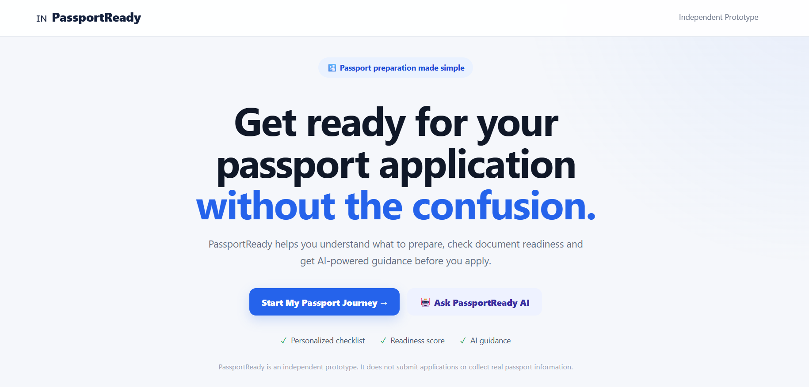

### 🛂 First Passport

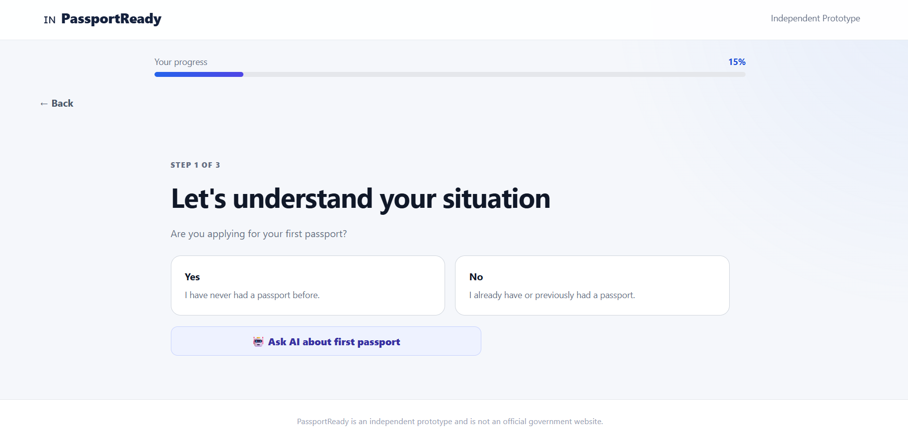

### 📍 Address

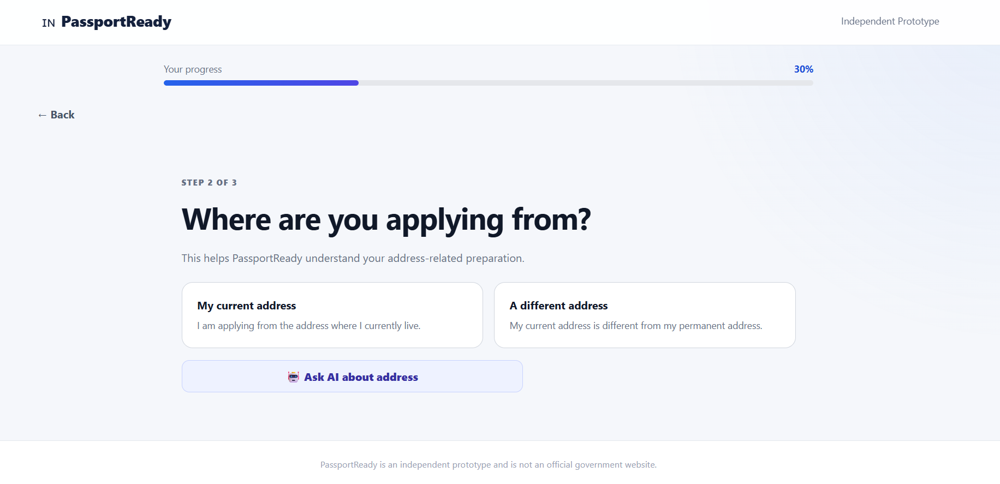

### 📄 Address Proof

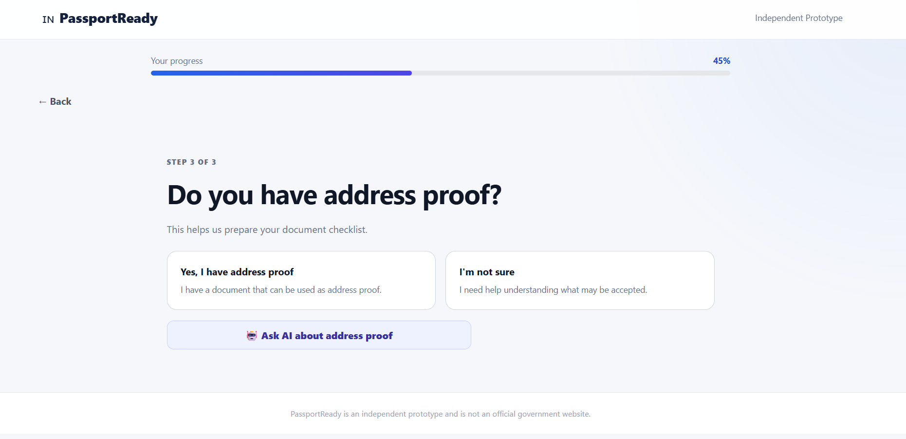

### 📝 Preparation Plan

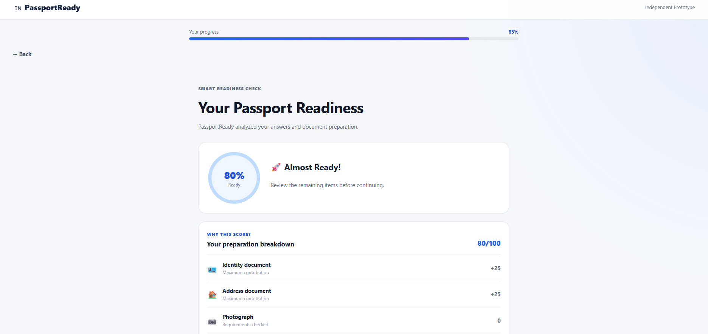

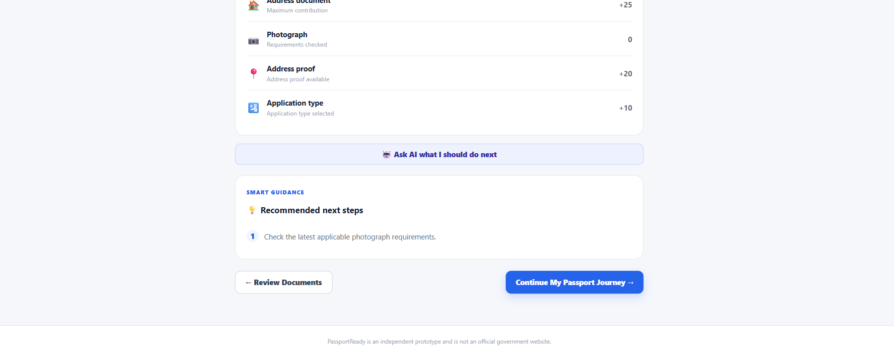

### 📋 Document Checklist

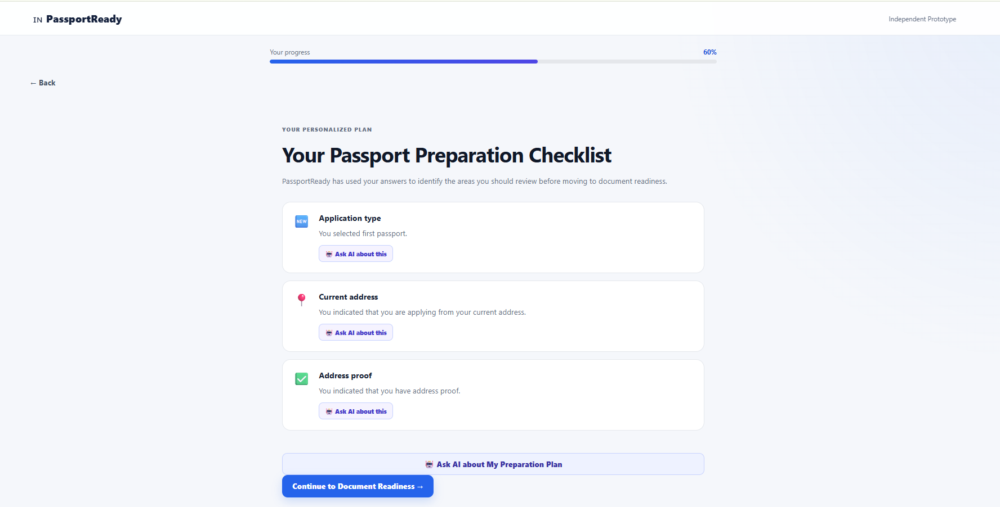

### 📊 Readiness Score

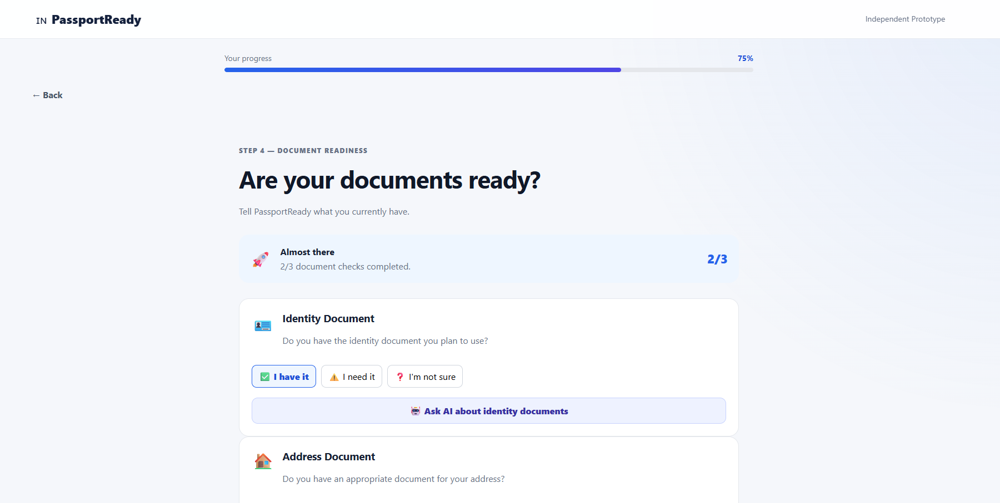

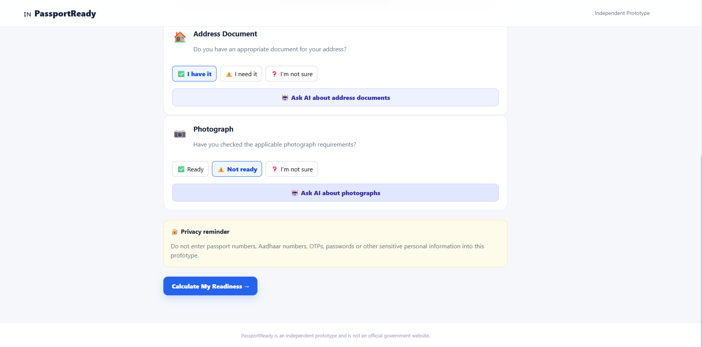

### 🧭 Passport Journey

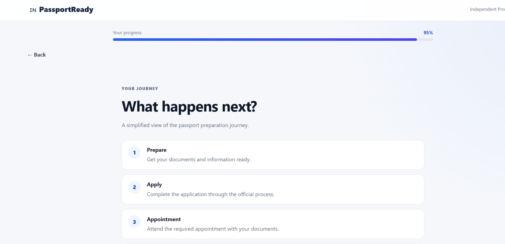

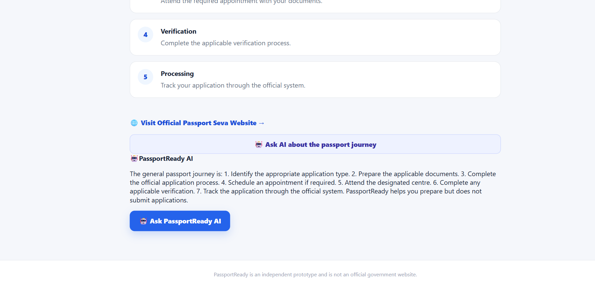

### 🤖 AI Assistant

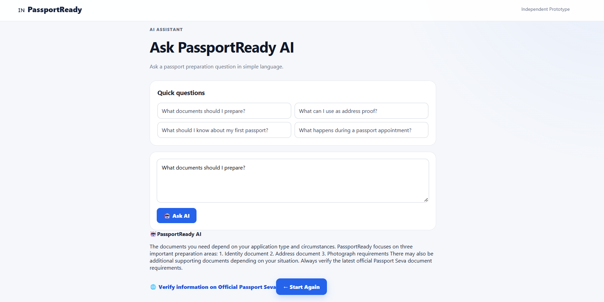

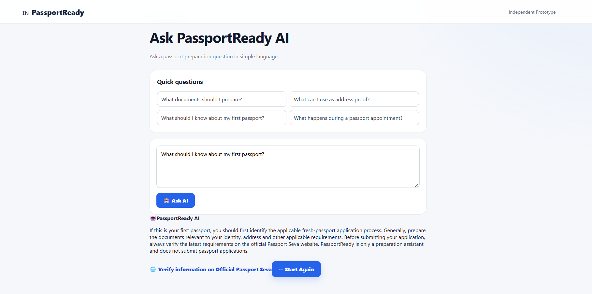

---

## 🛠️ Technology Stack

### Frontend

* React
* Vite
* JavaScript
* CSS
* Responsive UI

### Backend

* Python
* FastAPI
* REST API
* CORS
* JSON-based API communication

### AI Guidance

* Backend `/ask-ai` API
* Intent-based guidance
* Predefined preparation responses
* Common AI assistant across application steps

### Deployment

* GitHub
* Render
* Render Web Service
* Render Static Site

---

## 🏗️ Project Architecture

```text
passportready/
│
├── backend/
│   ├── main.py
│   ├── requirements.txt
│   ├── .env
│   └── ...
│
├── src/
│   ├── App.jsx
│   ├── App.css
│   └── ...
│
├── public/
│   └── ...
│
├── screenshots/
│   ├── Dashboard.png
│   ├── first-passport-question.png
│   ├── Address.png
│   ├── Address-proof.png
│   ├── Preparation1.png
│   ├── Preparation2.png
│   ├── Checklist.png
│   ├── Readiness1.png
│   ├── Readiness2.png
│   ├── PassportJourney1.png
│   ├── PassportJourney2.png
│   ├── AI-Assistant1.png
│   └── AI-Assistant2.png
│
├── package.json
├── vite.config.js
└── README.md
```

---

## 🔄 Application Workflow

```text
Start PassportReady
        ↓
First Passport Question
        ↓
Address Selection
        ↓
Address Proof
        ↓
Preparation Plan
        ↓
Document Checklist
        ↓
Readiness Score
        ↓
Passport Journey
        ↓
AI Assistant
        ↓
Official Passport Seva Guidance
```

---

## 🧪 Testing

The application was tested across the major user workflows:

* Home page navigation
* First passport selection
* Address selection
* Address proof selection
* Personalized preparation plan
* Document checklist
* Document readiness calculation
* Readiness score
* Recommendation display
* Passport journey
* AI assistant
* Quick AI questions
* Custom AI questions
* Backend API communication
* CORS configuration
* Responsive UI
* Frontend and backend deployment
* Production application verification

The deployed application was also verified with the live Render frontend and backend services.

---

## 💻 Run Locally

### Backend

```powershell
cd backend
python -m pip install -r requirements.txt
python -m uvicorn main:app --reload --host 127.0.0.1 --port 8000
```

Backend:

```text
http://127.0.0.1:8000
```

API documentation:

```text
http://127.0.0.1:8000/docs
```

### Frontend

Open another terminal:

```powershell
npm install
npm run dev
```

Frontend:

```text
http://localhost:5173
```

---

## ⚙️ Environment Variables

The backend uses environment variables for configuration where required.

Example:

```text
PORT=8000
```

Production configuration is managed through the deployment environment.

Sensitive configuration values are not committed to the repository.

---

## 🌐 Deployment

The application is deployed using Render.

### Frontend

```text
React + Vite
        ↓
Render Static Site
        ↓
PassportReady Web Application
```

### Backend

```text
FastAPI
   ↓
Render Web Service
   ↓
PassportReady API
```

The frontend communicates with the deployed backend through the `/ask-ai` API.

---

## 🎯 Project Objective

The main objective of PassportReady is to make passport application preparation easier to understand by providing users with a simple, guided, and interactive preparation experience.

The project focuses on:

* Reducing preparation confusion
* Helping users organize documents
* Providing a clear readiness overview
* Explaining the general passport application journey
* Providing accessible preparation guidance through an AI assistant

PassportReady is an independent prototype and is not affiliated with or operated by the Government of India or Passport Seva.

---

## 📚 What I Learned

Through this project, I worked with:

* React application development
* Vite project setup
* FastAPI backend development
* REST API development
* Frontend-backend integration
* CORS configuration
* API request handling
* State management in React
* Conditional rendering
* Dynamic readiness calculations
* Responsive UI development
* AI-assisted application workflows
* Git and GitHub
* Render deployment
* Frontend and backend deployment
* Production debugging
* Environment configuration
* Project documentation

---

## 🔮 Future Improvements

Potential future enhancements include:

* More comprehensive document guidance
* Improved AI responses
* Multilingual support
* Saved preparation progress
* User accounts
* Application status tracking
* Notification and reminder features
* Accessibility improvements
* Progressive Web App (PWA) support
* Integration with additional official information sources

---

## 👩‍💻 Developer

**Pavithra**

Full-Stack Developer | AI & Data Science Graduate

PassportReady was developed as an independent prototype to simplify passport application preparation through guided workflows, document readiness tracking, personalized recommendations, and AI-powered assistance.

**Important:** PassportReady is an independent prototype and is not an official Government of India or Passport Seva application.
